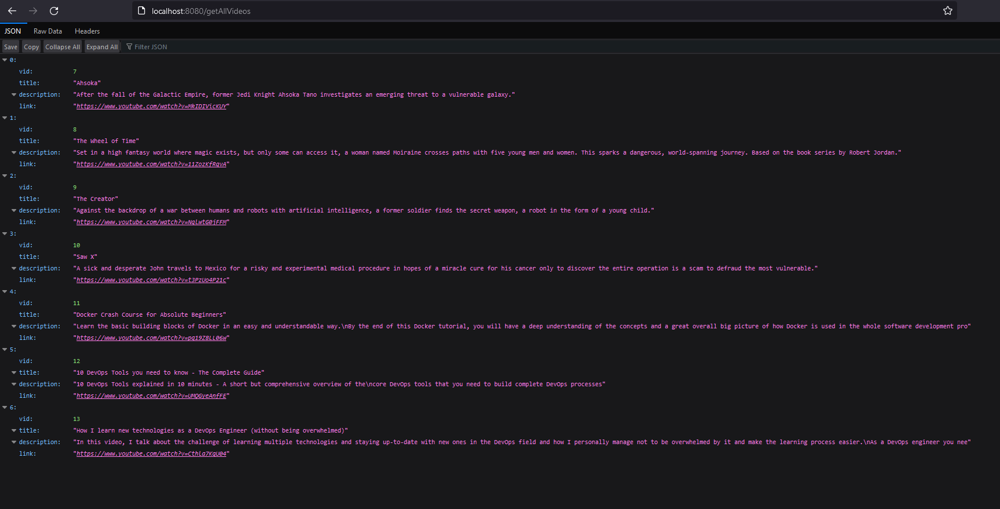
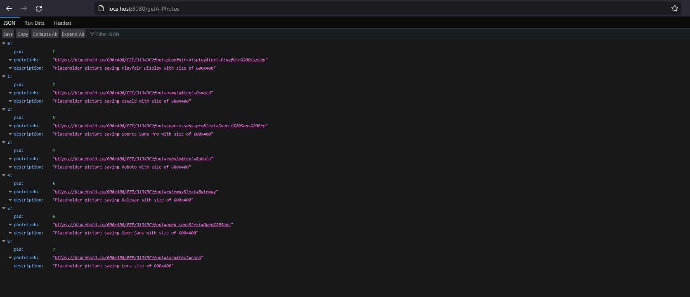

# Rest API Dynamic Content ([udemy](https://www.udemy.com))

Course: <b>Java Web Services and REST API with Angular Frontend</b>. 
Build Java Web Services & REST API - with Spring & Spring Boot. Learn REST API & Web Services  
Link: https://www.udemy.com/course/java-web-services-angular-dynamic-web-development.

# Introduction

The following was discovered as part of building this project:

- The original package name 'com.rest-api.restapi-dynamic-content' is invalid and this project uses '
  com.restapi.restapidynamiccontent' instead.

# Getting Started

## Requirements

- Apache Maven: `v3.5.2` or superior: <a href="https://maven.apache.org/download.cgi">Download here </a>
- XAMPP: `v3.3.0`: <a href="https://sourceforge.net/projects/xampp/files/XAMPP%20Windows/8.2.4/xampp-windows-x64-8.2.4-0-VS16-installer.exe/download">
  Download here</a>
- MySQL Workbench: `v8.0`: <a href="https://www.mysql.com/products/workbench/">Download here</a>

## Setup

Before running the project we need to setup the MySQL connection, import the schema and data. 
For the connection you will find the credentials here: `src\main\resources\application.properties`. 
Create a database called `dynamiccontent` first. 
For the schema simply import it from the export files:

- `sql\exports\dynamiccontent_photos.sql`
- `sql\exports\dynamiccontent_videos.sql`

## Screenshots

### getAllVideos

 

### getAllPhotos

 

# Reference Documentation

For further reference, please consider the following sections:

- [Official Apache Maven documentation](https://maven.apache.org/guides/index.html)
- [Spring Boot Maven Plugin Reference Guide](https://docs.spring.io/spring-boot/docs/3.2.0-SNAPSHOT/maven-plugin/reference/html/)
- [Create an OCI image](https://docs.spring.io/spring-boot/docs/3.2.0-SNAPSHOT/maven-plugin/reference/html/#build-image)
- [Spring Data JPA](https://docs.spring.io/spring-boot/docs/3.2.0-SNAPSHOT/reference/htmlsingle/index.html#data.sql.jpa-and-spring-data)
- [Spring Web](https://docs.spring.io/spring-boot/docs/3.2.0-SNAPSHOT/reference/htmlsingle/index.html#web)

# Guides

The following guides illustrate how to use some features concretely:

- [Accessing Data with JPA](https://spring.io/guides/gs/accessing-data-jpa/)
- [Building a RESTful Web Service](https://spring.io/guides/gs/rest-service/)
- [Serving Web Content with Spring MVC](https://spring.io/guides/gs/serving-web-content/)
- [Building REST services with Spring](https://spring.io/guides/tutorials/rest/)
